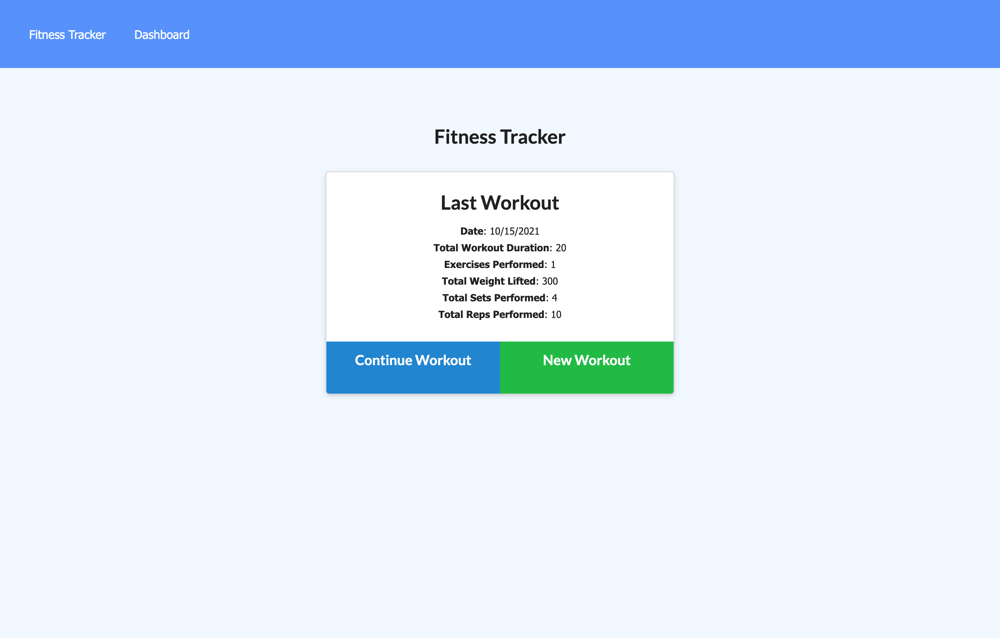
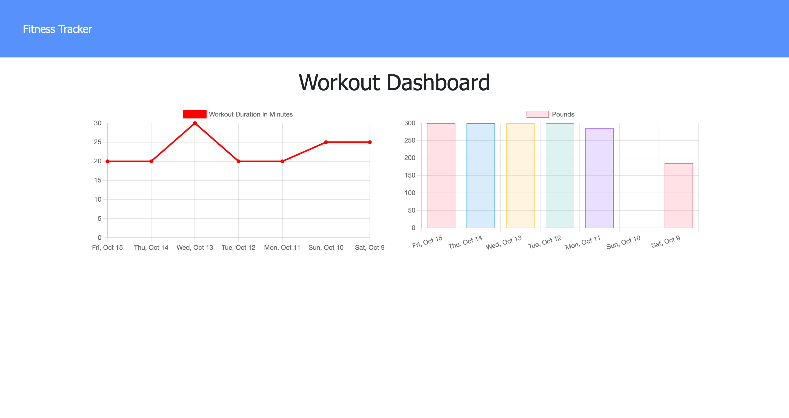

# workout-tracker

## Description

Dashboard that allows the user to interact with workout database by viewing recent workouts/exercises and their statistics.

## Table of Contents

* [Installation](#Installation)
* [Usage](#Usage)
* [Tests](#Tests)
* [Questions](#Questions)

## Installation

Required packages:
  * Node.js
  * Express.js
  * MongoDB
  * Mongoose.js
  * Morgan.js

The user must run `npm i` in the terminal to install dependencies. The database can then be seeded using the `npm run seed` command.

To start the application, use the command `npm start` to start the server. If accessing through the user's local device, the application can be found at `http://localhost:3000/`.

## Usage

The dashboard allows the user to view their last workout's statistics such as the date, total duration, exercises performed, total weight lifted, total sets performed, and total reps performed. On this page, the user can also either add an exercise to their previous workout or start a new workout.

The statistics page shows the user a graph of exercise statistics from their last 7 workouts. The graph on the left allows the user to see how their workout duration has changed. The graph on the right shows the user how many pounds they lifted during each workout session.

## Tests

### Dashboard

### Workout Statistics

## Questions

Do you have questions? Contact me here:

* [GitHub](https://github.com/laurenlgoss)
* [Email](laurenlgoss98@gmail.com)